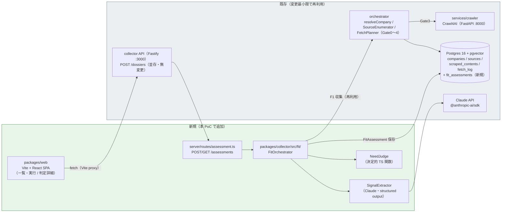
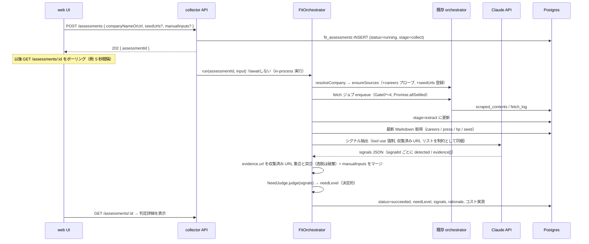

# Fit 判定 PoC 基本設計書

- ステータス: ドラフト v0.1
- 作成日: 2026-07-05
- 前提文書:
  - `docs/ui/fit-validation-requirements.md`（要件定義 v0.1 — 以下「要件 §n」で参照）
  - `docs/ui/fit-validation-signals.md`（シグナル定義 v0.2）
  - `docs/collection-cache-detailed-design.md`（既存 collector の詳細設計）

## 1. 目的・設計方針

公開 Web 情報のみで「問い合わせする価値がある企業か」を見極められるか、を検証する PoC の基本設計。

- **仮説検証 PoC。拡張性より「1〜2 週間で動く」を優先する**
- 収集層は `packages/collector` を**そのまま使う**（Gate0〜4 / Crawl4AI / robots・マナー・fetch_log）
- 新規に足すのは **Fit 判定層**（収集 Markdown → シグナル抽出 → need 判定）と**最小 UI** のみ
- 新しいサービス・プロセス・キュー基盤は増やさない

## 2. 全体アーキテクチャ



### コンポーネント一覧

| コンポーネント | 既存/新規 | 役割 |
|---|---|---|
| `packages/web` | **新規** | Vite + React SPA。2 画面（§6）。ビルド成果物は PoC ではローカル起動のみ |
| `server/routes/assessment.ts` | **新規** | `/assessments` エンドポイント群（§4） |
| `fit/fit-orchestrator.ts` | **新規** | collect → extract → judge → persist を直列実行し、進捗ステータスを DB に書く |
| `fit/signal-extractor.ts` | **新規** | 収集 Markdown からシグナルを LLM 抽出（§7）。`claude/dossier-generator.ts` と同型の作り |
| `fit/need-judge.ts` | **新規** | 集約ルール（要件 §4-2）の決定的実装。LLM を使わない |
| `fit/careers-probe.ts` | **新規** | 採用ページの自動プローブ（§3-2） |
| `scripts/assess-poc.ts` | **新規** | CLI から 1 社判定 + `poc-output/<domain>/fit-judgement.{json,md}` 出力（評価用） |
| `orchestrator`（既存 4 クラス） | 既存 | 収集はそのまま再利用。`SourceEnumerator` にのみ careers 対応の小改修（§3-2） |
| `POST /dossiers` / `DossierGenerator` | 既存 | **無変更・並存**（§4-3） |
| `services/crawler` / compliance / queue | 既存 | 無変更 |

## 3. Fit 判定パイプライン

要件 F1〜F3（要件 §5）に対応。1 実行 = 1 `fit_assessments` 行。段ごとの中間結果を行内に持ち、失敗時はどの段で落ちたかを記録する。



### 3-1. 各段の設計

| 段 | 内容 | 要件対応 |
|---|---|---|
| **collect** | 既存 `resolveCompany` + `SourceEnumerator.ensureSources` + fetch ジョブ（`collect-poc.ts` と同じ流れ）。部分失敗は許容し、取得できなかったソースを `missingData` に記録（silent skip 禁止） | F1, §6-2 |
| **extract** | 対象コンテンツ: careers（全件）+ press 最新 5 件 + corporate_hp 最新 + seedUrls 由来。1 件 8,000 字スライス・トークン予算は `DOSSIER_MAX_CONTEXT_TOKENS` を流用（`buildContext` と同じ方式）。Claude 1 コールで全シグナルを一括抽出（§7） | F2 |
| **judge** | `NeedJudge`: 要件 §4-2 の表をそのまま条件分岐で実装。収集最低要件（要件 §6-3: careers 確認 + 求人情報 1 件 + PR 1 件）未達なら **シグナルに関係なく `unknown`**。逆指標が 1 件でもあれば high にしない（S2 対応） | F3, §4-2 |
| **persist** | `fit_assessments` 更新（§5）。CLI 実行時のみ `poc-output/<domain>/fit-judgement.{json,md}` も出力 | §7 |

### 3-2. careers ソースの追加（既存への唯一の改修）

現状 `SourceEnumerator` は corporate_hp + press feed のみをブートストラップする（`source_kind` enum に `careers` は定義済みだが未使用）。Fit 判定にはシグナル 1-4 / 1-5 / 5-1 のために採用ページが必須なので、以下を追加する:

- **自動プローブ** (`fit/careers-probe.ts`): `https://<domain>/` に対し `/recruit`, `/careers`, `/recruitment`, `/jobs`, `/careers/engineer` 等の一般的パスを Gate2（conditional GET）で順に確認。robots・レートリミットは既存 `RateLimiter` / `RobotsGuard` を通す
- **確認結果は成否ともに記録**: 404 だった URL のリストも assessment の `careersCheck: { checkedUrls[], foundUrl? }` に残す — 「確認したが無かった」がシグナル 1-5（逆指標）の根拠になる（要件 §6-1 の出典必須）
- **手動シード優先**: リクエストの `seedUrls` に careers URL があればプローブをスキップしてそれを使う

### 3-3. 求人媒体・口コミの手動入力（manualInputs）

要件 §6-1 のとおり、求人媒体（規約 NG の場合）と転職口コミ（OpenWork 等）は**自動収集しない**。人間が目視確認した内容を `manualInputs` としてリクエストに含め、extract 結果へ**そのままシグナルとしてマージ**する（LLM を通さない。`evidence.source = "manual"` で機械判定と区別できるようにする）:

```jsonc
"manualInputs": [
  {
    "signalId": "2-1",
    "url": "https://www.openwork.jp/...",   // 人間が確認した URL
    "quoteSummary": "エンジニアから評価制度への不満が直近 3 件",
    "checkedAt": "2026-07-05"
  }
]
```

求人媒体（Wantedly / Green / HERP）の自動収集可否は実装前に robots.txt / 規約を確認して振り分ける（要件 §11）。自動収集可のものは `seedUrls` に `kind: "jobs_media"` で渡し、既存 Gate2/Gate3 で取得する。

## 4. API 設計

### 4-1. エンドポイント一覧

| Method | Path | 役割 |
|---|---|---|
| `POST` | `/assessments` | 判定を開始。**202 を即返す非同期方式** |
| `GET` | `/assessments/:id` | 1 件取得（ステータス + 結果）。UI がポーリング |
| `GET` | `/assessments` | 一覧（企業ごと最新、`created_at` 降順） |
| `PATCH` | `/assessments/:id/human-review` | 人間判定の記録（要件 §8 の突き合わせ用） |

**非同期にする理由:** 収集は同一ドメイン 10〜20 秒間隔・並列 1 本（要件 §6-2）のため、careers プローブ + press 本文で 1 社あたり数分かかる。同期 HTTP（既存 /dossiers 方式）では UI から使えない。PoC では新しいキュー基盤は入れず、リクエストプロセス内で `FitOrchestrator.run()` を fire-and-forget 実行し、進捗は `fit_assessments.status / stage` の更新で表す。

### 4-2. リクエスト / レスポンス

```jsonc
// POST /assessments — リクエスト
{
  "companyNameOrUrl": "https://example.co.jp",   // 既存 /dossiers と同じ解決ロジック（DomainRequiredError も同様）
  "seedUrls": [                                   // 任意。要件 §5 F1「手動シード」
    { "kind": "careers", "url": "https://example.co.jp/recruit" },
    { "kind": "jobs_media", "url": "https://www.green-japan.com/company/..." }
  ],
  "manualInputs": [ /* §3-3 参照 */ ],            // 任意
  "allowManaged": false                           // 既存 Gate4 opt-in と同じ
}

// → 202
{ "assessmentId": "uuid", "status": "running" }

// GET /assessments/:id — レスポンス（succeeded 時。要件 §7 のスキーマと整合）
{
  "id": "uuid",
  "status": "succeeded",            // running | succeeded | failed
  "stage": "done",                  // collect | extract | judge | done（running 中の進捗表示用）
  "company": { "name": "...", "domain": "example.co.jp" },
  "judgedAt": "2026-07-05T...",
  "signalsVersion": "v0.2",
  "promptVersion": "v1",
  "needLevel": "high",              // high | medium | low | unknown
  "signals": [
    {
      "id": "1-1",
      "detected": true,
      "strength": "strong",         // strong | weak | counter
      "evidence": [
        { "url": "https://...", "quoteSummary": "...", "checkedAt": "2026-07-05", "source": "extracted" }
      ]
    }
  ],
  "counterSignals": [],
  "missingData": ["2-1"],
  "careersCheck": { "checkedUrls": ["https://example.co.jp/recruit"], "foundUrl": "https://example.co.jp/recruit" },
  "rationale": "求人シグナル 1-1（6ヶ月以上の継続募集）を検出。逆指標なし。",
  "humanReview": { "needLevel": "high", "mismatchReason": null, "reviewedAt": "..." },  // PATCH 後のみ
  "cost": { "inputTokens": 41200, "outputTokens": 1800, "model": "claude-opus-4-8", "durationMs": 213000 }
}
```

エラー系は既存 /dossiers に合わせる: 400 `invalid_request`（zod）/ 409 `domain_required` / 判定失敗は 200 で `status: "failed"` + `error` フィールド（ポーリングで取得するため HTTP エラーにしない）。

### 4-3. 既存 `POST /dossiers` との関係 — **並存（無変更）**

置き換えない。理由:

- 用途が異なる。dossier = 営業カルテ生成（自由記述 Markdown）、assessment = Fit 判定（構造化 JSON + 決定的判定）。次フェーズ（問い合わせ文面生成）で dossier 側を使う可能性が高い
- 収集層（orchestrator）は両者で共有されるため、コード重複はほぼない
- PoC で既存動作を壊すリスクを取る理由がない

## 5. データ設計

### 5-1. 永続化方針: **DB 必須 + 評価用ファイル出力の併用**

要件 §11 の「DB 必須か、JSON ファイルで足りるか」への結論: **DB 必須**。

- UI の一覧・ポーリング・人間判定の記録（要件 §8）には検索可能なストアが必要
- Postgres は docker-compose で常時起動済みで追加コストがほぼない
- JSONB 1 テーブルに寄せるので、正規化の設計コストも払わない
- 評価ワークフロー（要件 §8: 10 社の突き合わせ）用に、CLI (`scripts/assess-poc.ts`) 経由の実行では `poc-output/<domain>/fit-judgement.{json,md}` も併せて出力する（要件 §7 のファイル形式）

### 5-2. `fit_assessments` テーブル（migration `0002_fit.sql`）

```sql
CREATE TYPE need_level AS ENUM ('high', 'medium', 'low', 'unknown');
CREATE TYPE assessment_status AS ENUM ('running', 'succeeded', 'failed');

CREATE TABLE fit_assessments (
  id               uuid PRIMARY KEY DEFAULT gen_random_uuid(),
  company_id       uuid NOT NULL REFERENCES companies(id),
  status           assessment_status NOT NULL DEFAULT 'running',
  stage            text NOT NULL DEFAULT 'collect',     -- collect | extract | judge | done
  need_level       need_level,                          -- succeeded 時のみ
  signals          jsonb,          -- 要件 §7 の signals[] 全体（evidence 込み）
  missing_data     jsonb,          -- 取得不可・履歴不足のシグナル ID
  careers_check    jsonb,          -- { checkedUrls[], foundUrl? } — シグナル 1-5 の根拠
  rationale        text,
  input            jsonb NOT NULL, -- リクエスト（seedUrls / manualInputs）の写し。再実行の再現用
  signals_version  text NOT NULL,  -- fit-validation-signals.md のバージョン（要件 §4-3）
  prompt_version   text NOT NULL,
  model            text,
  input_tokens     int,
  output_tokens    int,
  duration_ms      int,            -- S5 コスト実測（要件 §2-2）
  error            text,
  -- 人間評価（要件 §8 突き合わせ）
  human_need_level need_level,
  mismatch_reason  text,           -- collection_gap | extraction_error | rule_issue | private_info | null
  human_reviewed_at timestamptz,
  created_at       timestamptz NOT NULL DEFAULT now(),
  finished_at      timestamptz
);
CREATE INDEX ON fit_assessments (company_id, created_at DESC);
```

補足:

- **signals は JSONB で正規化しない**（PoC。シグナル定義の改訂 v0.2→v0.3 でスキーマ変更が要らない）
- 同一企業の再実行は**新規行**（履歴として残す。signalsVersion 別の一致率比較 — 要件 §4-3 — に使う）
- `counterSignals` は `signals` 内の `strength: "counter"` から導出できるため専用カラムは持たない

### 5-3. 既存 enum の拡張（同 migration に含める）

- `source_kind` に `'jobs_media'` を追加（`careers` は定義済み）。`source_type` に `'careers_page'`, `'job_posting'` を追加（scraped_contents の分類用）
- `source_freshness_policy` に `jobs_media` 行を追加（poll なし・HTML TTL 7 日 = careers と同等）
- **注意:** `schema.sql` は docker init mount（初回のみ実行）のため、既存ボリュームには `psql` で 0002 を手動適用する。手順は migration ファイル冒頭のコメントに書く

## 6. UI 設計（packages/web）

画面は 2 つ + 遷移のみ。認証なし・localhost 前提。

```
[一覧 & 実行 /] ──(行クリック)──> [判定詳細 /assessments/:id] ──(戻る)──> [一覧]
```

### 画面 1: 企業一覧 & 実行（`/`）

```
┌──────────────────────────────────────────────────────────┐
│ Fit 判定 PoC                                              │
├──────────────────────────────────────────────────────────┤
│ 企業 URL: [https://example.co.jp        ] [＋詳細オプション] │
│   └ (展開時) seedUrls (careers/求人媒体 URL) 追加行         │
│   └ (展開時) manualInputs (シグナルID / URL / 要約) 追加行   │
│                                          [判定を実行]      │
├──────────────────────────────────────────────────────────┤
│ 企業            need    状態        人間評価   実行日時     │
│ example.co.jp   HIGH    完了        HIGH ✓    07-05 14:02 │
│ foo.co.jp       ―       実行中(収集) ―         07-05 14:10 │
│ bar.co.jp       LOW     完了        未記入     07-04 18:30 │
│ baz.co.jp       UNKNOWN 完了        ―         07-04 17:00 │
└──────────────────────────────────────────────────────────┘
```

- needLevel はバッジ表示（high / medium / low / unknown で色分け）
- 実行中の行は `stage`（収集中 / 抽出中 / 判定中）を表示し、5 秒間隔でポーリング
- 「人間評価」列で S1 突き合わせの進捗（10 社中何社記入済みか）が一目で分かる

### 画面 2: 判定詳細（`/assessments/:id`）

```
┌──────────────────────────────────────────────────────────┐
│ ← 一覧へ    example.co.jp          [HIGH]   2026-07-05    │
│ 判定根拠: 求人シグナル 1-1 を検出。逆指標なし。              │
├──────────────────────────────────────────────────────────┤
│ ■ 検出シグナル                                            │
│  1-1 長期募集      強い   evidence: wantedly.com/...(07-05)│
│  5-1 カルチャー強調 弱い   evidence: example.co.jp/recruit  │
│ ■ 逆指標: なし                                            │
│ ■ 取得できなかった情報: 2-1（口コミ・手動未入力）           │
│ ■ careers 確認: /recruit ✓（確認 URL 一覧を展開表示）      │
│ ■ コスト: 3.6 分 / in 41.2k / out 1.8k tok (opus-4-8)     │
├──────────────────────────────────────────────────────────┤
│ ■ 人間判定（ブラインド記入 — システム判定を見る前に決める）  │
│  need: (high/medium/low/unknown)  不一致理由: (4 分類+null) │
│                                              [保存]       │
└──────────────────────────────────────────────────────────┘
```

- evidence の URL はすべて外部リンク（フォーム営業前に人間が 1〜2 分で妥当性確認 — 要件 §7）
- 人間判定フォームは `PATCH /assessments/:id/human-review` に対応。**運用注意として「正解づけはシステム実行前に別途行う」旨を画面に明記**（要件 §8-2 のブラインド原則。画面はあくまで記録先）

## 7. LLM プロンプト設計方針（SignalExtractor）

`claude/dossier-generator.ts` と同じ構成（`@anthropic-ai/sdk` 直接利用）で `fit/signal-extractor.ts` を新設。モデルは `env.FIT_MODEL`（default は `DOSSIER_MODEL` と同じ `claude-opus-4-8`）。

### 7-1. 入出力

- **system prompt:** シグナル定義 v0.2 をカタログ（id / 名称 / 意味 / 強弱 / 誤判定注意）としてそのまま埋め込む。役割は「シグナル検出者」— **need_level の判定はさせない**（judge はコード。要件 F3）
- **user message:** `buildDossierUserMessage` と同様の番号付きコンテキスト `[n] <url>\n<markdown>` + **「引用可能 URL リスト」**（収集済み canonical URL の列挙）
- **出力:** tool use を 1 つ定義し `tool_choice` で強制。スキーマ（zod で検証）:

```jsonc
{
  "signals": [
    {
      "signalId": "1-1",                    // カタログの ID に限定（enum）
      "detected": true,
      "evidence": [{ "url": "...", "quoteSummary": "..." }],
      "insufficientHistory": false          // 1-1/1-2 の時系列不足時に true（要件 F2）
    }
  ]
}
```

### 7-2. ハルシネーション対策（3 層）

| 層 | 対策 |
|---|---|
| プロンプト | evidence.url は「引用可能 URL リスト」内のものに限る、と明示。憶測での detected 禁止・迷ったら detected: false |
| コード検証 | 返ってきた evidence.url を収集済み URL 集合と**突合し、逸脱 evidence は破棄**。evidence が 0 件になったシグナルは detected: false に落とす（要件 §4-1「出典必須」の機械的担保） |
| 判定分離 | need_level は `NeedJudge`（決定的コード）のみが決める。収集最低要件（要件 §6-3）未達 → unknown もコード判定 |

### 7-3. その他

- `quoteSummary` は**要約のみ・逐語転載禁止**を system prompt に明記（`docs/legal-review-checklist.md` の方針。特に口コミ・求人票）
- `insufficientHistory: true` のシグナルは judge 上「検出なし」と同扱い + `missingData` に記録（誤検出より欠損 — 要件 F2）
- `promptVersion` / `signalsVersion` / モデル / usage トークン数 / 所要時間を毎回 `fit_assessments` に記録（S5 コスト実測、要件 §4-3 のバージョン管理）

## 8. 技術選定

| 項目 | 選定 | 理由 |
|---|---|---|
| web フロント | **Vite + React SPA**（`packages/web`、TS strict） | ワークスペースの技術方針（TS/pnpm）に一致。2 画面 + ポーリング程度なら最速で書ける |
| 状態管理 | `@tanstack/react-query` | ポーリング（実行中のみ 5 秒）・キャッシュ無効化・mutation が要件の中心で、素の fetch + setInterval より宣言的でバグが減るため採用（詳細設計 §D-3 で確定） |
| BFF | **作らない** | SPA → collector API 直。開発時は Vite の dev proxy（`/assessments` → :3000）で CORS 回避。localhost 限定の PoC に認証・集約層は不要 |
| Fit 層の置き場所 | `packages/collector/src/fit/`（**新パッケージにしない**） | 既存 DI グラフ（repos / queue / orchestrator）をそのまま注入でき、配線コストゼロ。分離は製品化時に判断 |
| 非同期実行 | in-process fire-and-forget + DB ステータス | pg-boss / BullMQ は入れない（既存 `InProcessQueue` と同じ割り切り。§9 リスク 5 参照） |
| 変更しないもの | orchestrator の Gate 判定・compliance・queue・crawler・/dossiers・embeddings | 収集層は実績のある動作を凍結して使う（SourceEnumerator への careers 追加のみ例外） |

## 9. リスクと対策

| # | リスク | 影響 | 対策 |
|---|---|---|---|
| 1 | **誤判定（特に逆指標見落とし → high）** | S2 違反。競合・提携先へ営業してしまう | judge をコード実装し「逆指標 ≥1 なら high 禁止」をハード制約に。UI の人間判定欄で全件確認（要件 §8） |
| 2 | **採用ページ・求人媒体が取れない**（robots 拒否 / アンチボット / パス推測失敗） | シグナル 1-x が欠損し unknown 率が S4（30%）超過 | careers プローブ失敗時は UI から seedUrls で手動指定 → 再実行。求人媒体は manualInputs フォールバック。unknown の理由（missingData / careersCheck）を必ず表示し「収集の問題」と「シグナル無し」を区別 |
| 3 | **求人の掲載期間（1-1）・条件変更（1-2）が初回実行で取れない** | 最重要シグナルが機能しない | `insufficientHistory` として欠損扱い（誤検出しない）。PoC 期間中に定点収集して 2 回目以降の実行で差分を見る。Wayback 等の利用可否は実装前調査（要件 §11） |
| 4 | **法務**（口コミ・求人媒体の規約、口コミ引用） | 商用化前リスクの先送り増 | 口コミは自動収集しない（manualInputs のみ）。quoteSummary は要約限定。fetch_log / legal_basis の記録は既存のまま継続。論点は `docs/legal-review-checklist.md` に集約 |
| 5 | **in-process 非同期ジョブがプロセス再起動で消える** | running のまま孤児化 | PoC 許容。サーバー起動時に `status='running'` の行を `failed`（error: 'interrupted'）へ倒し、UI から再実行 |
| 6 | **LLM 出力の evidence 破棄でシグナルが痩せる**（捏造ガードの副作用） | 偽陰性増 → 一致率低下 | 破棄した evidence 数をログに残し、evidence 全滅が頻発するならプロンプト改訂（promptVersion を上げて比較） |

## 10. 実装順序の目安（1〜2 週間）

1. migration 0002（fit_assessments + enum 拡張）と `FitAssessment` 型（`packages/shared`）
2. `NeedJudge`（決定的 judge）— 先に単体テストで要件 §4-2 の全分岐を固定
3. `SignalExtractor`（プロンプト + tool use + URL 突合）
4. careers プローブ + `SourceEnumerator` の careers 対応
5. `FitOrchestrator` + `scripts/assess-poc.ts`（この時点で CLI 評価が回る = 最小検証可能）
6. `/assessments` ルート（非同期 + ポーリング + human-review PATCH）
7. `packages/web`（一覧 & 実行 → 判定詳細）
8. 10 社評価の実施（`docs/ui/fit-validation-results.md` に記録 — 要件 §8）

CLI（手順 5）まで到達すれば UI がなくても仮説検証は開始できる。UI は評価と並行して進める。


## プロンプト
```
@docs/ui/fit-validation-requirements.md を前提に、
docs/ui/fit-validation-design.md を新規作成してください。
## 設計方針
- **仮説検証 PoC**。拡張性より「1〜2週間で動く」
- 収集層は packages/collector をそのまま使う（Gate0〜4、Crawl4AI）
- **新規に足すのは「Fit 判定」層**（収集 Markdown → シグナル抽出 → need 判定）
- UI は最小（1〜3 画面）
## 決めてほしいこと
1. 全体アーキテクチャ（図: mermaid）
   - 既存: collector API / DB / crawler
   - 新規: fit-scorer（LLM）、web UI
2. Fit 判定パイプライン
   - 入力: company URL
   - 収集: 既存 orchestrator 再利用
   - 分析: 新プロンプト（シグナルごとに evidence 付き）
   - 出力: FitAssessment JSON
3. API 設計（新規エンドポイント案）
   - 例: POST /assessments { companyNameOrUrl }
   - 既存 POST /dossiers との関係（置き換え / 並存）
4. データ永続化方針
   - PoC では DB必須か、JSON ファイル保存で足りるか
5. UI 構成
   - 画面一覧と遷移
   - 主要画面のワイヤ（テキストで OK）
6. LLM プロンプト設計方針
   - ハルシネーション対策（出典なしは unknown）
   - シグナルごとの structured output
7. 技術選定（web フロント、BFF の要否）
8. リスク（誤判定、採用ページ取れない、法務）
## 制約
- フォーム自動送信はスコープ外
- product-concept の「7章カルテ」構成は採用しない
- 実装コードはまだ書かない
```